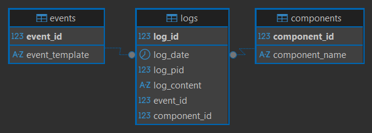

# Log-ETL-OpenSSH
The script for moving OpenSSH logs to the PostgreSQL database is written in Python

### Information
- Log sources: https://github.com/logpai/loghub/tree/master/OpenSSH
- The database structure is depicted below

### Installation and start
1. Install PostgreSQL and create an empty database
2. Execute SQL script from file a
3. Create an .env file and prepare a connection to the database
4. Add the required libraries from file a
5. Prepare a file with logs
6. In file a, specify the path to the file with logs and run the script
